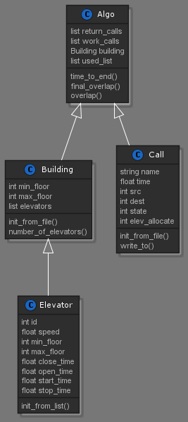

# Off-line elevators allocation system
> made by Elad Seznayev and Nerya Bigon.
* As part of OOP course assignment.

Our goal in this repository is to creat an off-line elevator allocation algorithm, that works as efficiently as possible.
we define efficiency as reducing the time passed from the moment a call was received until the elevator reached the destination.

## Approach:
An offline elevators allocation algorithm is an algorithm, design to allocate elevators to passengers when all the input is given in advance.  
The fact that the input is already known, on one hand give the algorithm extra time to calculate the best allocation posible.  
But on the other hand introduce a complication to the problem of allocation - the need to simulate somehow the movment of the elevators, in order to calculate the location of each elevator in any given moment.  
In this repository we will attempt to suggest an appoach for an offline algorithm without the need to simulate the movment of the elevators.

## Offline Algorithm:
Because we do not simulate the elevators movment, most of the work our algorithm do involve mostly the information that is already in the calls file.
Essentially for every elevator the algorithm attemt to create the longest list posible of a calls that will overlap with each other in term of times, floor range and direction of travel.  
Once every elevator got their first list the calls on that list are allocated to the output and the algorithm perform the same steps repeatedly until it get "stuck" - meanning, it can no longer perform without exceeding a list boundaries.  
Then if there are still a few calls that wasn't allocated, we allocate them sepparately.

#### the algorithm in steps: 
1. Loop on every elevator in the building, and for every elevator loop on every call in the call list, and for every call loop again on all the rest of the calls.
2. Check if the current call is in the time frame of the main call we are on. If so, check if it is in the same direction and that the source floor of the current call is between the source and destination of the main call. 
3. If it is, append it to a list of the main call.
4. Append the list to a list of the current elevator.
5. Find the longest list in the elevator list of calls lists and allocate those calls to the current elevator.
6. After doing so for all of the elevators, do so again until you can't.
7. Allocate remainimg calls if there are any.

## UML diagram:

## How to run:
make sure the necessary files are in the same folder, the files are:
1. All of the code files.
2. A JSON building file on the same level of the Ex1.py file.
3. A CSV calls file on the same level of the Ex1.py file.

Next, open a terminal window in the src folder and run the following command:  

`python3 Ex1.py <building.json> <calls.csv> <output.csv>`
